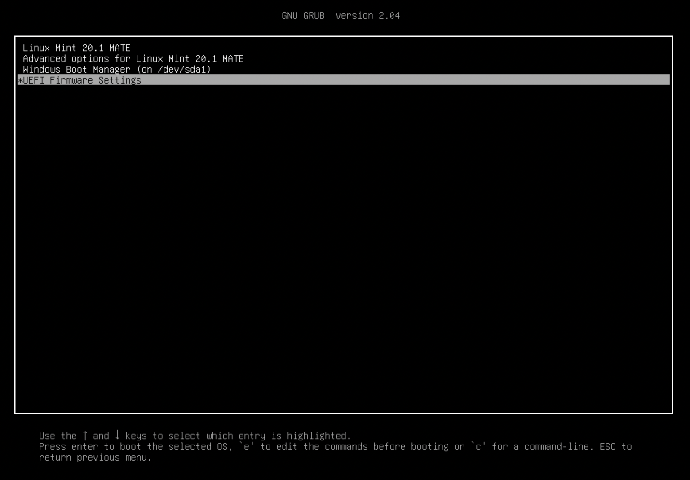
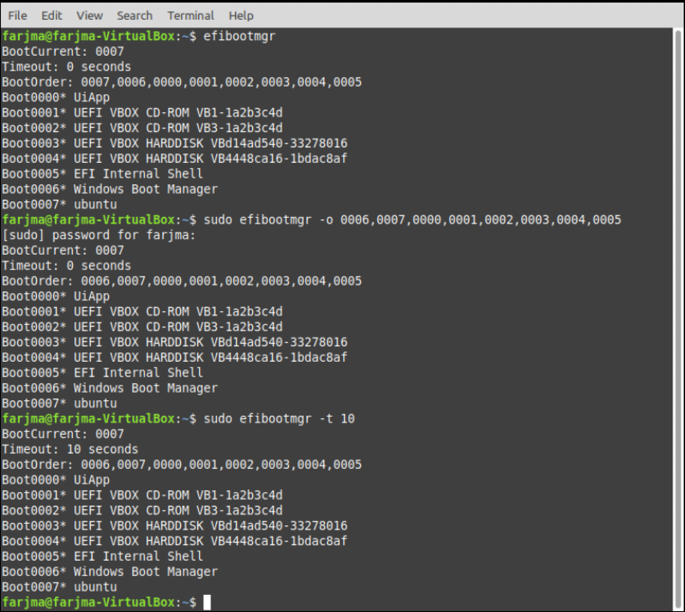
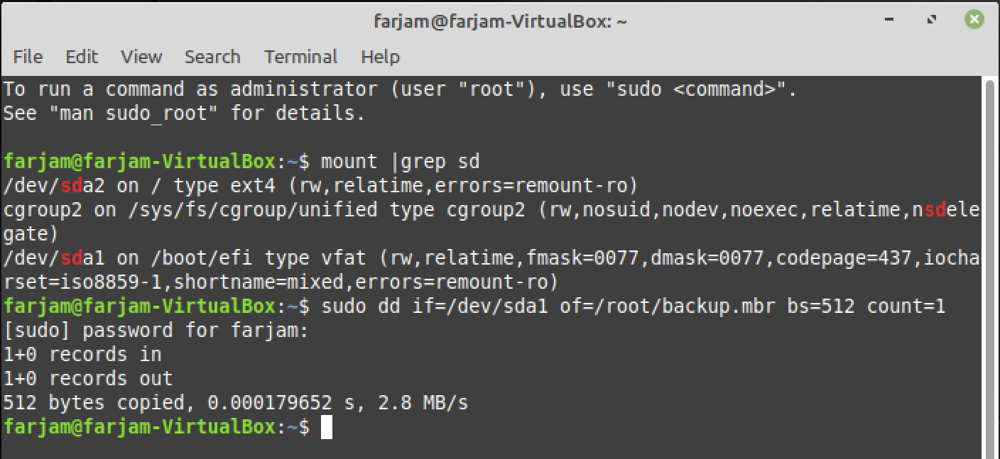
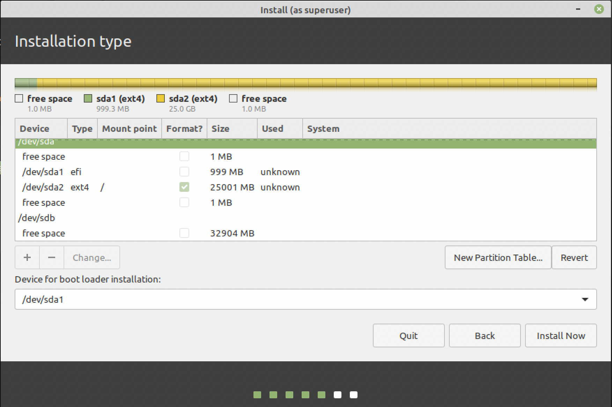
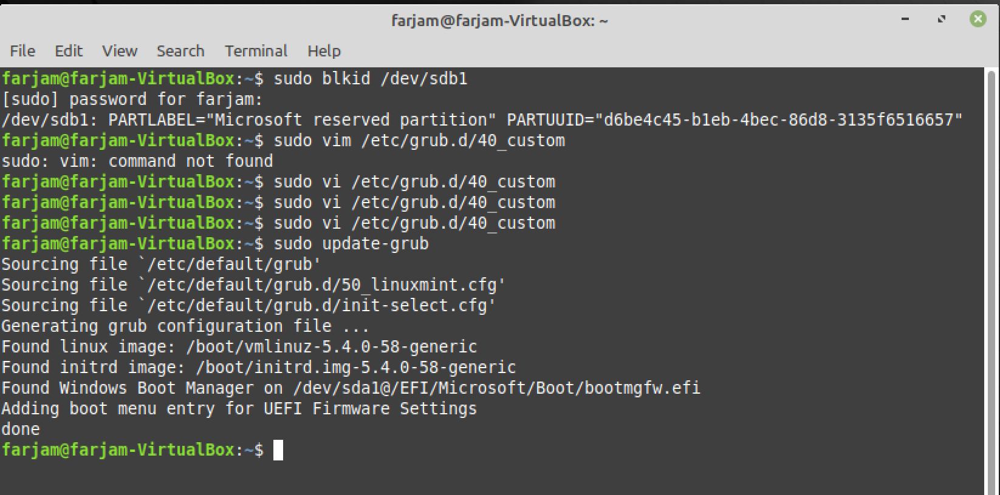
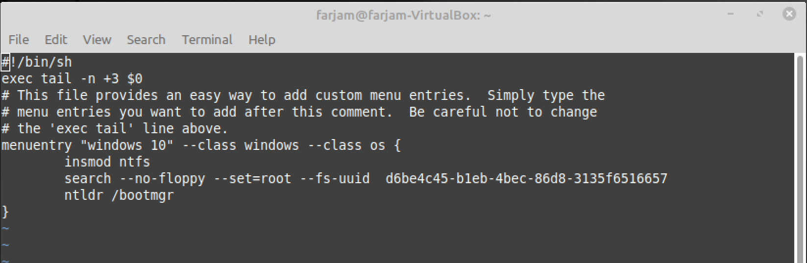
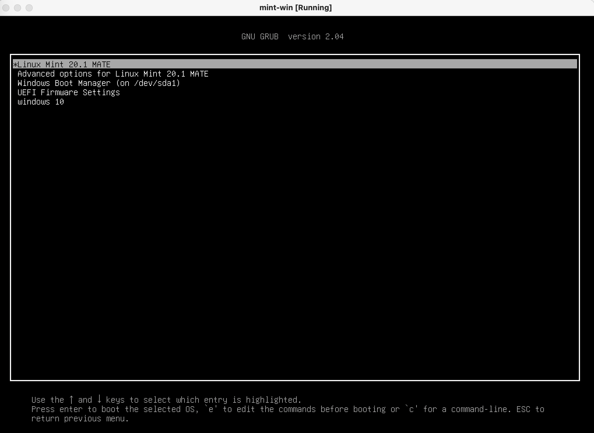
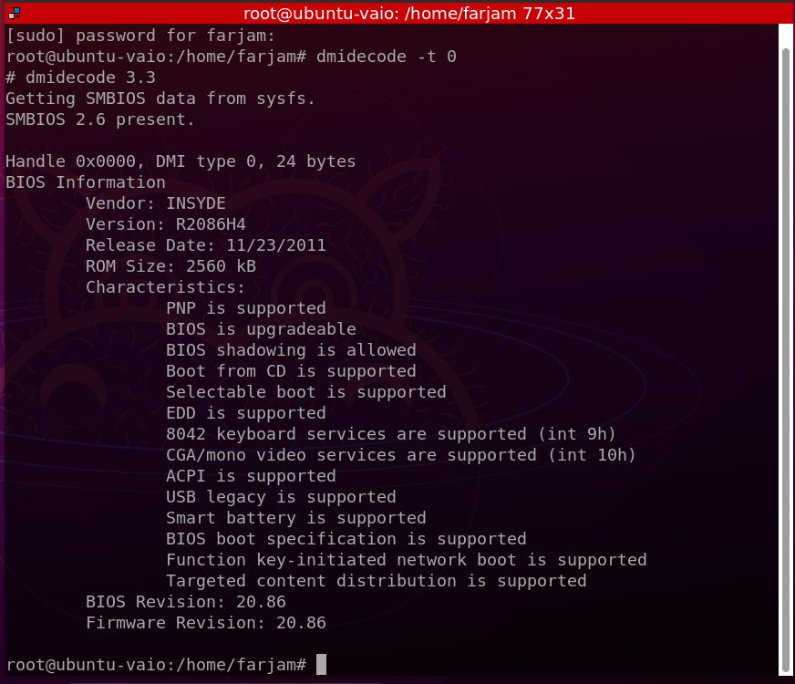

# LIPC2-01 ( Mr.Salahshoor Class Homework )

## Exercise 1
1. Windows was installed 
2. Linux was installed on separate partition 
3. With efibootmgr boot order and timeout was changed

## Exercise 2
1. Linux was installed
2. Backup of MBR was created in case sth happend 
3. Windows was installed on sdb
4. New entry for windows was added to grub.d/40_custom
5. Grub was Updated

## Exercise 3
1.  dmidecode command was used to show info regarding laptop firmware

