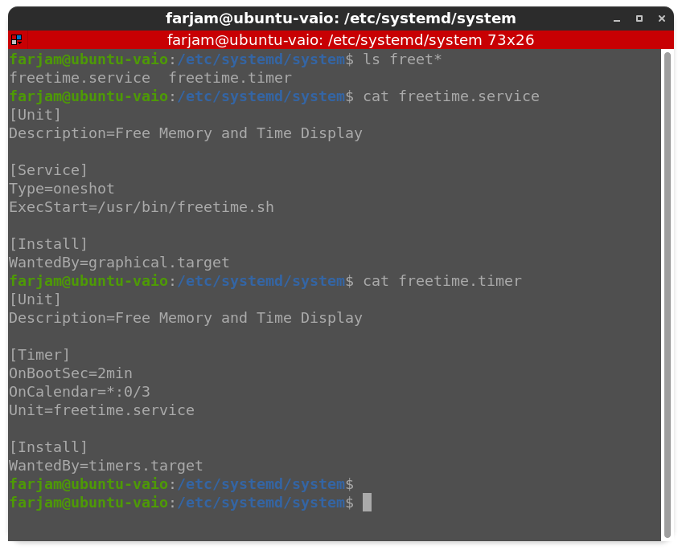
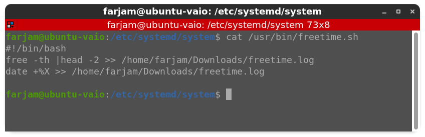
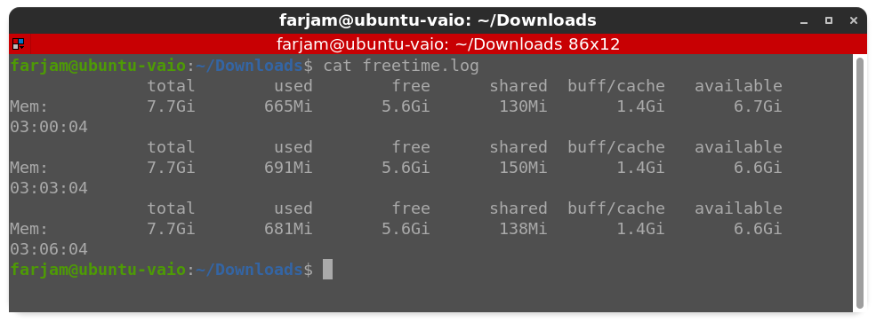
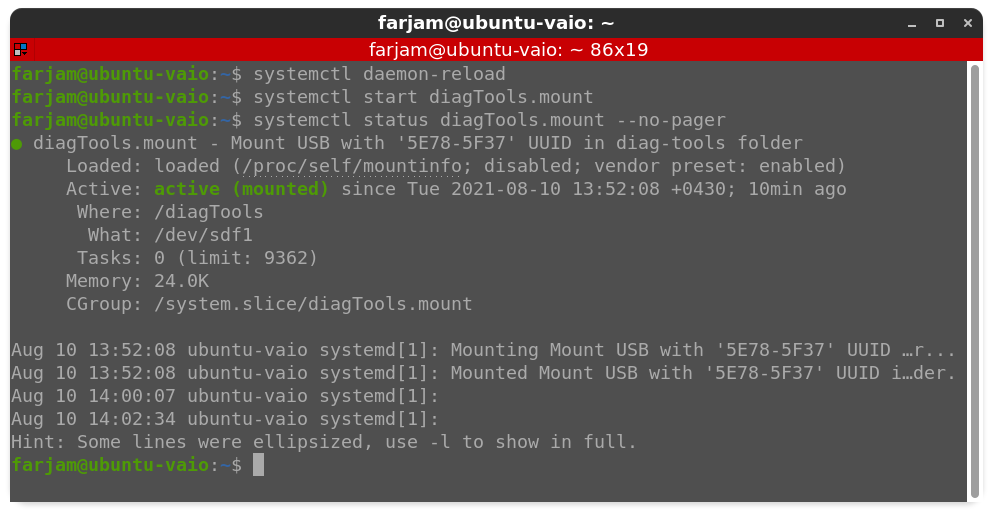

# LIPC2-02 ( Mr.Salahshoor Class Homework )

## Exercise 1
1. freetime.service and freetime.timer was created 
2. timer run service every 3 min
3. freetime.sh will return freememory space and time
4. log will save in freetime.log

## Exercise 2
1. find the UUID of drive
2. make diagTools.mount file in /etc/systemd/system
3. run deamon-reload command 
4. start diagTools.mount

