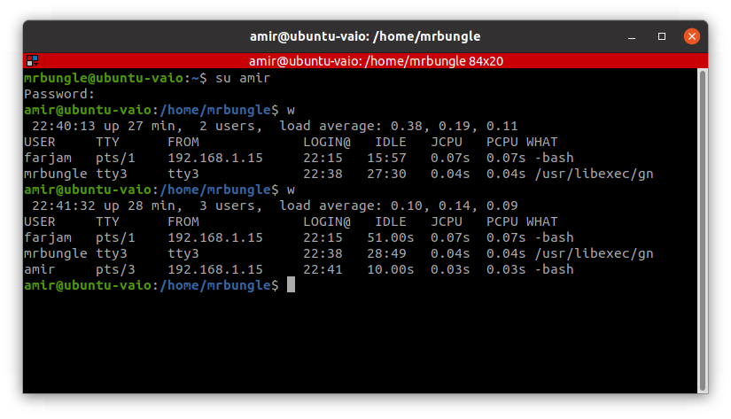
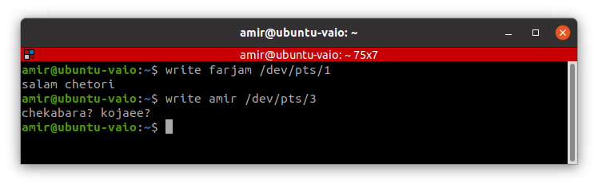
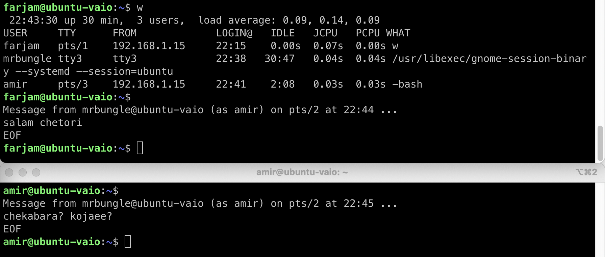
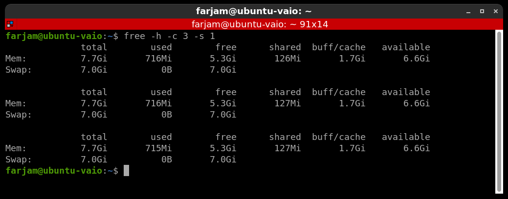
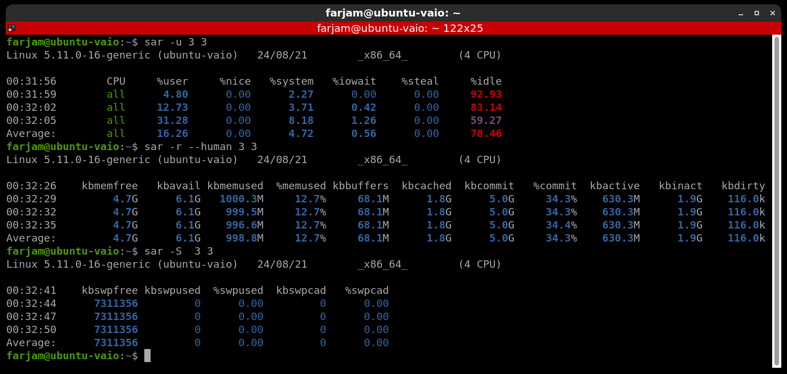
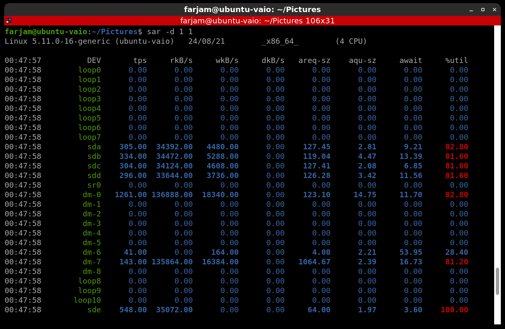
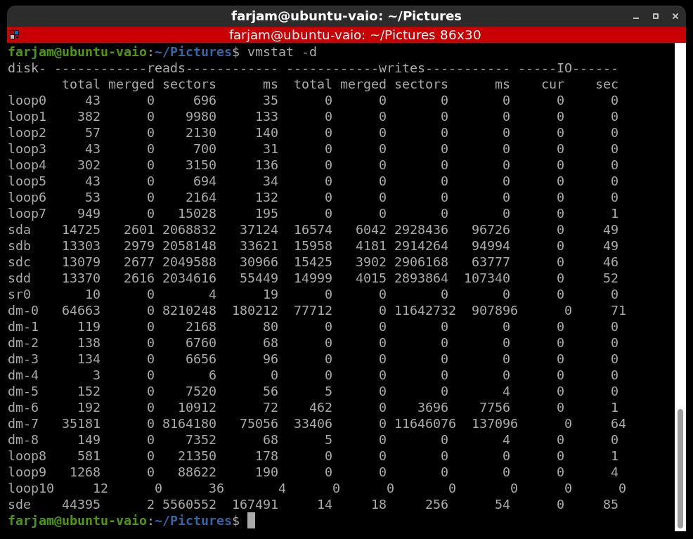
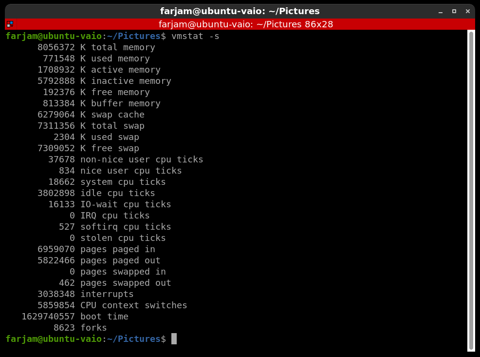
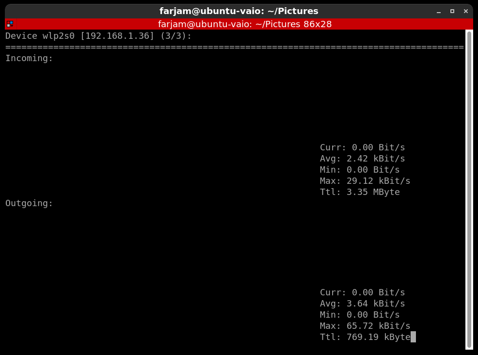
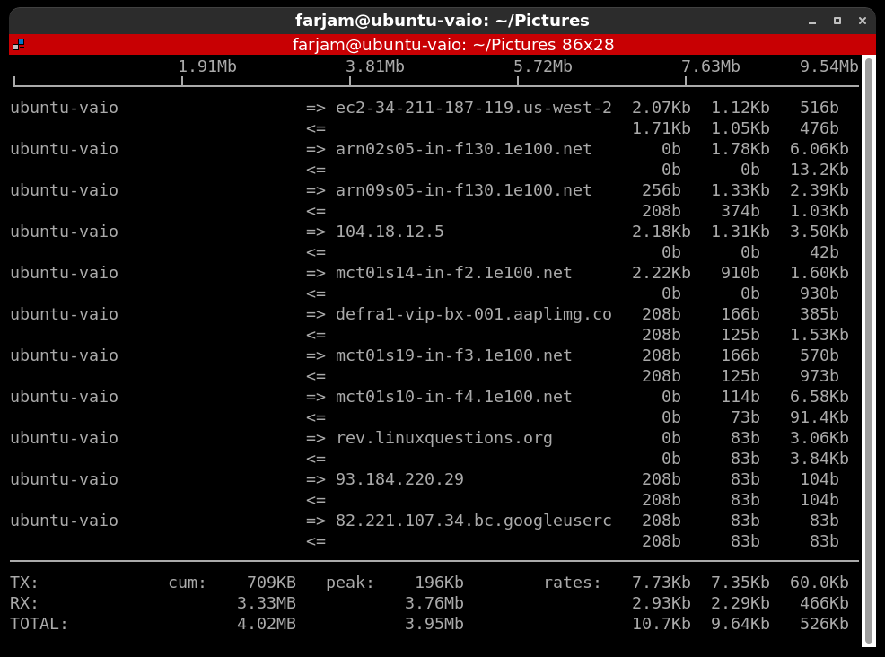

# LIPC2-03 ( Mr.Salahshoor Class Homework )

## Exercise 1
1. 3 users were created 
2. With ssh I connect to system
3. With w command all active users and their terminals were displayed

## Exercise 2
1. With write command I send massage to other users

## Exercise 3
1. Free command was used to show memory info
2. Sar command was used to show CPU, memory, sawp and disks info
3. Vmstat command used to show disk and system info

## Exercise 4
1. Nload command was used to show wlan uploads and downloads speed
2. With iftop command network info was listed.

