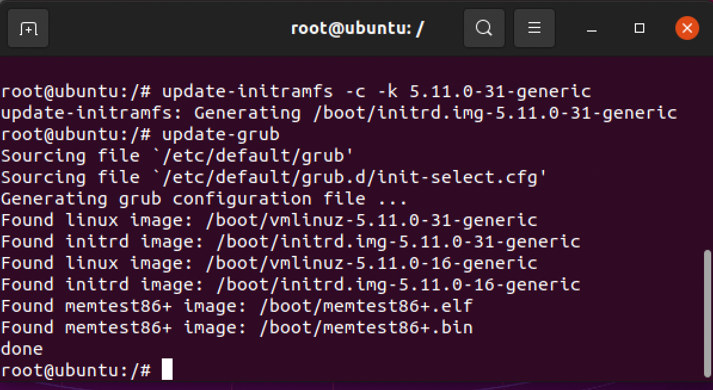

# LIPC2-04 ( Mr.Salahshoor Class Homework )

## Exercise 1
1. with echo command we chenge content of initram file. 
2. as we see in pic 2-1 system could not boot 
3. we need to boot the system with live CD and fix initram file
4. then we mount some directory in filesystem and change root directory to /mnt:
```bash
sudo fdisk -l
sudo mount /dev/sdaX /mnt
sudo mount --bind /dev /mnt/dev
sudo mount --bind /proc /mnt/proc
sudo mount --bind /sys /mnt/sys
sudo chroot /mnt
```
5. now we could fix inirram file with update-initramfs command
6. finally we should update grub




## Exercise 2
1. we use "modprobe" command with "show-depends" option to list dependencies of a module
2. we could update module dependencies with "depmod" command.


## Exercise 3
1. download linux kernel version 5.14.0-rc7
2. extract tar file in /usr/src/linux folder
3. copy config file of older kernel from /boot folder to /usr/src/linux to use it as a staring point.
4. install needed program to compile kernel source code.
5.use make xconfig of make defcinfig to build config file.
6.use make command to compile kernel then copy it to /boot folder 
7.for modules I used "make modules" then "make modules-install"
8. with build initrd file with "mkinitramfs" command 
9. finally we update grub to include new kernel in boot menu.


