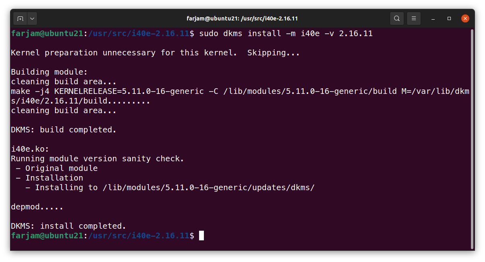
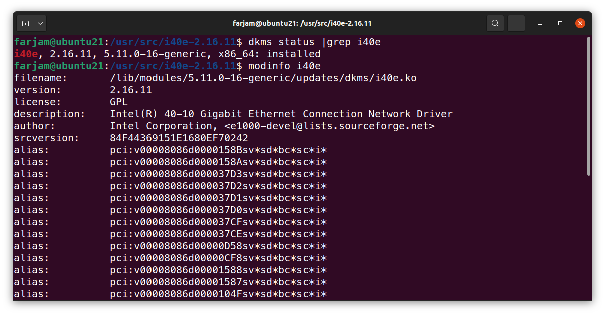

# LIPC2-05 ( Mr.Salahshoor Class Homework )

## Exercise 1
1. Download and unzip source code and then move them to /usr/local/src. 

```bash
sudo tar -xf i40e-2.16.11.tar.gz -C /usr/local/src/
sudo mv /usr/local/src/i40e-2.16.11/src /usr/src/i40e-2.16.11
```

2. make dkms.conf file
```bash
cd /usr/src/i40e-2.16.11
sudo vim dkms.conf
```

3. add dkms.conf file
```bash
sudo dkms add -m i40e -v 2.16.11
```

4. build dkms 
```bash
sudo dkms install -m i40e -v 2.16.11
```

5. get status of i40e module
```bash
dkms status |grep i40e
modeinfo i40e
```

6. remove and add i49e module 


## Exercise 2
1. copy source code from git repository 
```bash
git clone https://github.com/vicgeralds/vitetris.git
```
2. configure and make binary file for tetris game


3. run the game with ./tetris command


## Exercise 3
1. get attribute of a device with --attribute-walk option
```bash
udevadm info --attribute-walk /dev/sda
```


## Exercise 4
1. get a divice event with dmesg
```bash
sudo dmesg -T |grep usb |tail -20
```

2. get recent device events with udevadm
```bash
udevadm monitor
```


## Exercise 5
1. use lsusb to get VendorID and ProductID
```bash
lsusb
```

2. also we could use udevadm to get vendor and product IDs and serial No of a device.
```bash
udevadm info -an sde|grep inVendor
udevadm info -an sde|grep serial
```

3. create a script to write a log file when its executed.


4. create new rule in /etc/udev/rules.d folder for our usb. then we reload udev config to add our new rule.
```bash
sudo udevadm control --reload
```

5. every time we attach our usb, a new line will append to log file.


