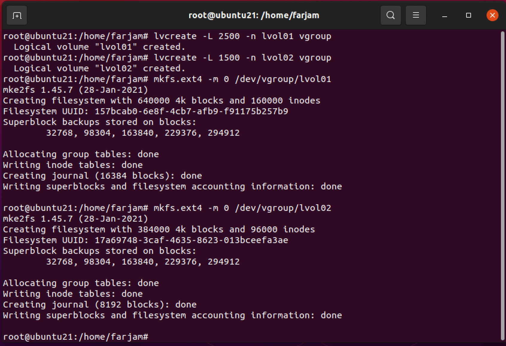

# LIPC2-06 ( Mr.Salahshoor Class Homework )

## Exercise 1
1. make 5 disk with 2GB space in virtual box


2. with fdisk we make a partition for each disk then specify "fd" for type of partition.

```bash
fdisk /dev/sdb
```


3. make raid disk with adadm command 
```bash
mdadm --create /dev/md0 --level=6 --raid-devices=4 /dev/sdb1 /dev/sdc1 /dev/sdd1 /dev/sde1
```


4. make filesystem for raid disk them mount it
```bash
mkfs.ext4 /dev/md0

mount /dev/md0 /mnt/myraid6
```


5. add raid device to /etc/fstab


6. add mdadm.conf and update initramfs
```bash
mdadm --detail --scan --verbose > /etc/mdadm/mdadm.conf

updateinitramfs -u
```


7. add spare disk
```bash
mdadm --add /dev/md0 /dev/sdf1
```


8. update mdadm.conf to include spare disk.


## Exercise 2
1. create 4 partition


2. crate btrfs disk and mount it

```bash
mkfs.btrfs -m raid10 -d raid10 /dev/sdb1 /dev/sdb2 /dev/sdb3 /dev/sdb4
```


3. mount btrfs

```bash
mkdir /mnt/mybtrfs
mount /dev//sdb1 /mnt/mybtrfs
```


4. create subvolume

```bash
btrfs subvolume create /mnt/mybtrfs/mydocs
```


5. create snapshot

```bash
btrfs subvolume snapshot /mnt/mybtrfs/mydocs /mnt/mybtrfs/mydocs/mydocs.snap
```


## Exercise 3
1. create 3 physical volume
```bash
pvcreate /dev/sdc1 /dev/sdd1 /dev/sde1
```


2. create one volume group
```bash
vgcreate vgroup /dev/sdc1 /dev/sdd1 /dev/sde1
```


3. create 2 logical volume and filesystem
```bash
lvcreate -L 2500 -n lvol01 vgroup
lvcreate -L 1500 -n lvol02 vgroup

mkfs.ext4 -m 0 /dev/vgroup/lvol01
mkfs.ext4 -m 0 /dev/vgroup/lvol02
```


4. mount lvol01 and put some files on it then create a snapshot of it.
```bash
lvcreate --size 1G --snapshot --name mysnap /dev/vgroup/lvol01
```

5. extend lvol01, first we should unmount and inactive both lvol01 and its snapshot
```bash
lvchange -an /dev/vgroup/lvol01
lvchange -an /dev/vgroup/mysnap

lvextend -L +500 /dev/vgroup/lvol01
```


6. resize lvol01 partition
```bash
resize2fs /dev/vgroup/lvol01
```


7. restore our snapshot with lvconvert command
```bash
ulvconvert --merge /dev/vgroup/mysnap
```


