# LIPC2-07 ( Mr.Salahshoor Class Homework )

## Exercise 1
1. find ip address of server (target) and generate an IQN
```bash
iscsi-iname
```

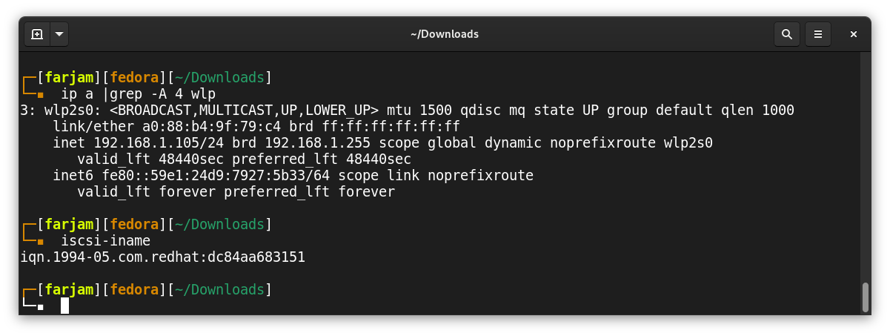

2. edit iscsi.conf and make a target

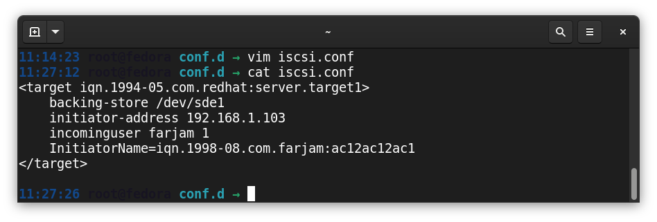

3. check status of tgt
```bash
systemctl status tgtd
```
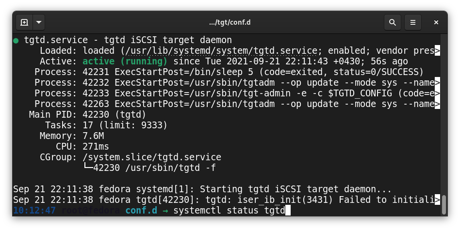

4. show target status with tgtadm
```bash
tgtadm --mode target --op show
```
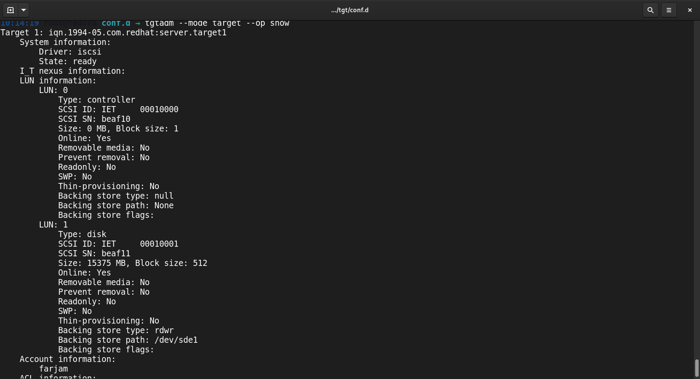


5. add initiator name in client pc

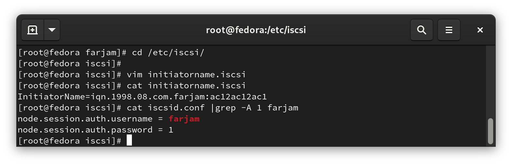

6. restart iscsid
```bash
systemctl enable iscsid
systemctl restart iscsid
```
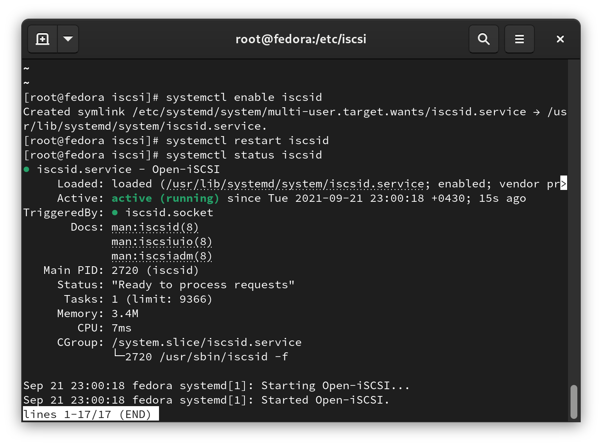

7. connect to the server (target)
```bash
iscsiadm -m discovery -t st -p 192.168.1.105
iscsiadm -m node --loginall all
iscsiadm -m session -o show
```

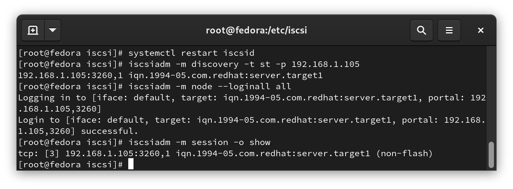


## Exercise 2
1. use netstat to show all tpc which are establish
```bash
netstat -ant |grep ESTABLISHED
```

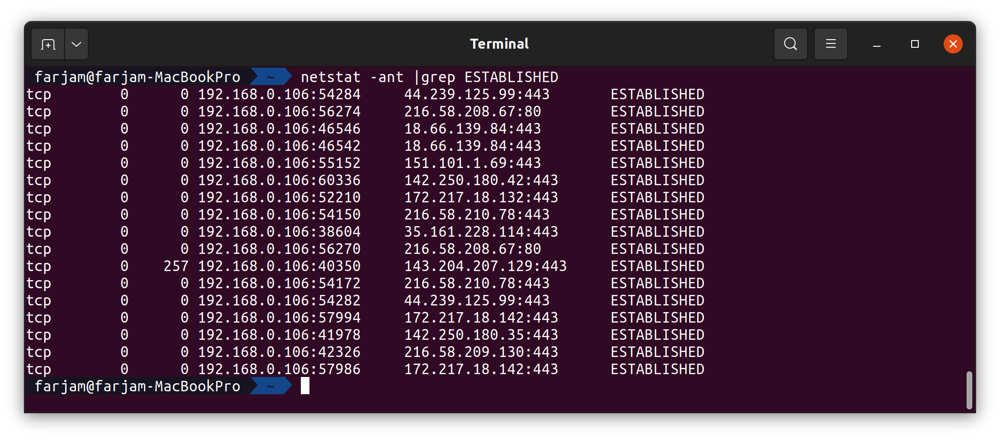


## Exercise 3
1. use lsof to show all tpc which are establish
```bash
lsof -i |grep ESTABLISHED
```

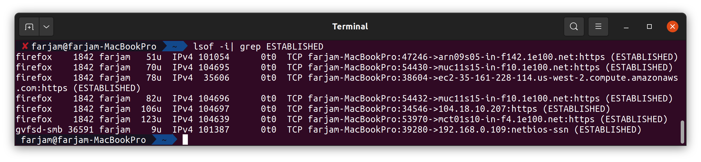


## Exercise 4
1. show info of the xfs partition
```bash
xfs_info /dev/sdf
```

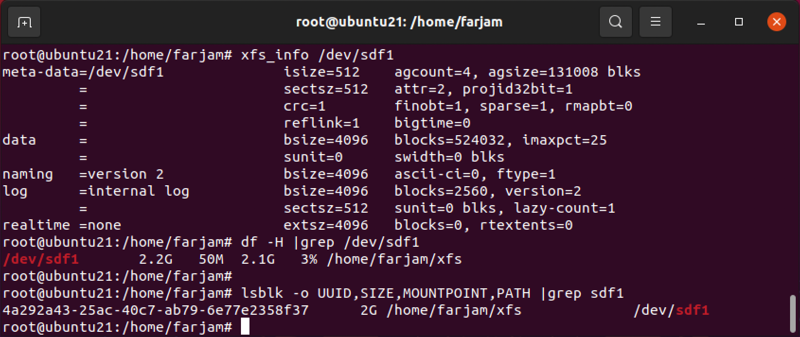

2. show info of the ext4 partition.

```bash
dump2fs /dev/sda3 |head -20
```
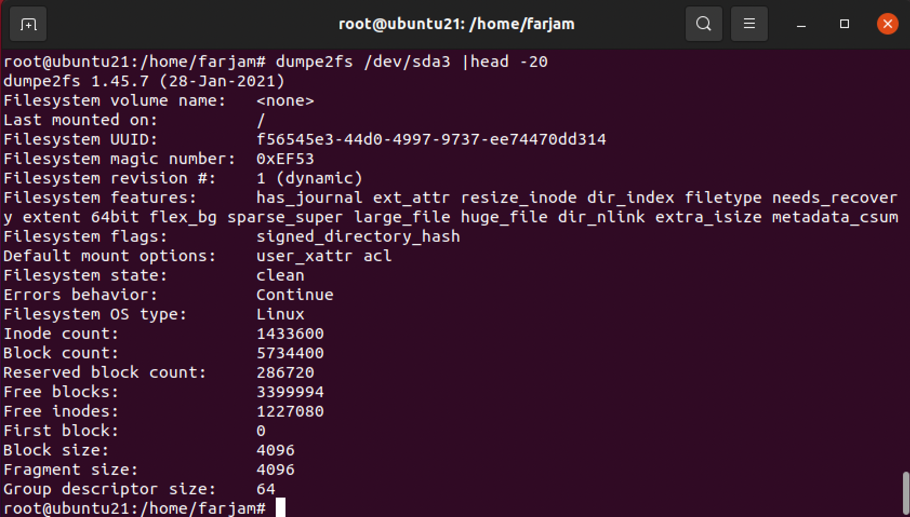

3. check filesystem 
```bash
fsck.ext4 /dev/vgroup/lvol01
```
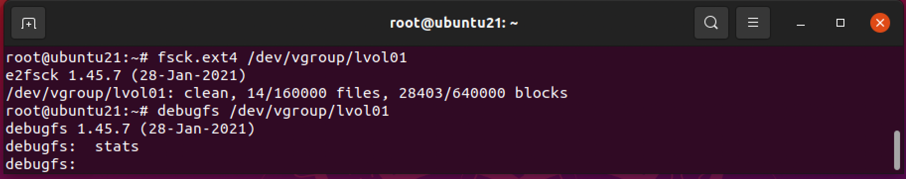

4. debug a filesystem
```bash
debugfs /dev/vgroup/lvol01
```
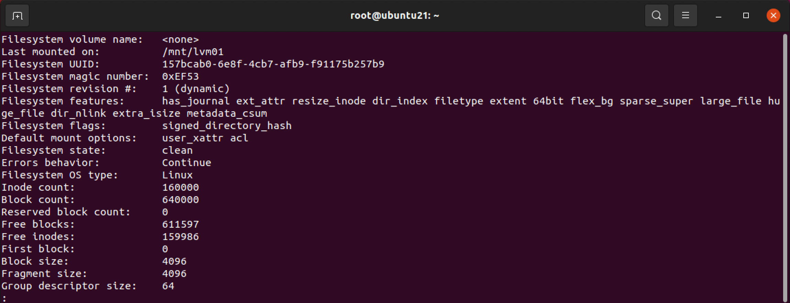

## Exercise 5
1. make a swap filesystem
```bash
dd if=/dev/zero of=/myswap bs=1024k count=1000
sudo chmod 600 /myswap
mkswap /myswap
swap on /myswap
vim /etc/fstab
```
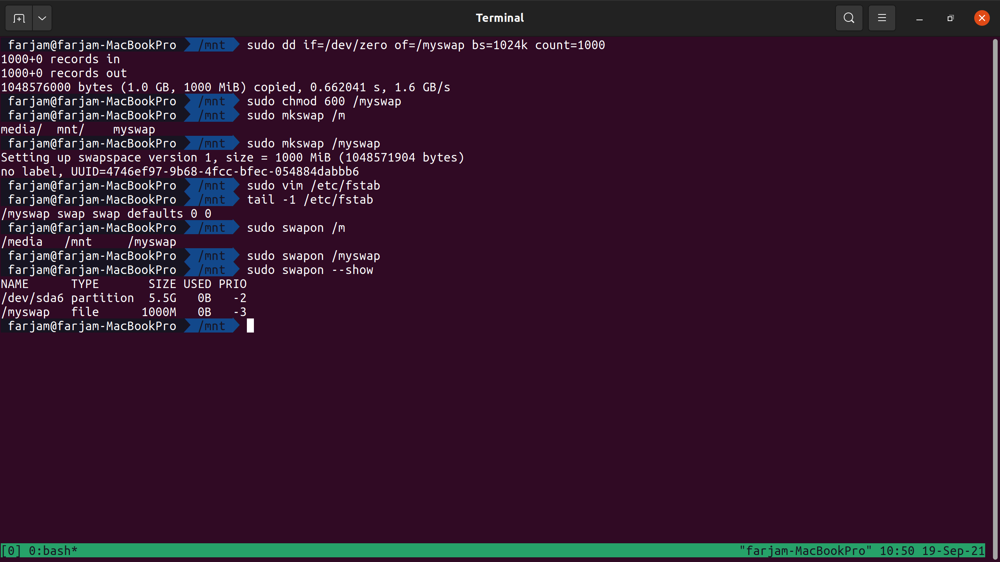


## Exercise 6
1. maek backup from route

```bash
ip route save 1> route.back
```

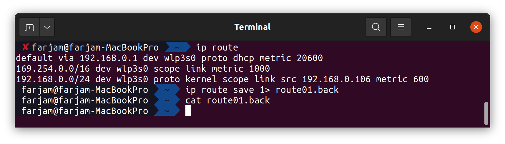


2. make backup from arp table

```bash
arp -n |tail -1 >arp.back
```
