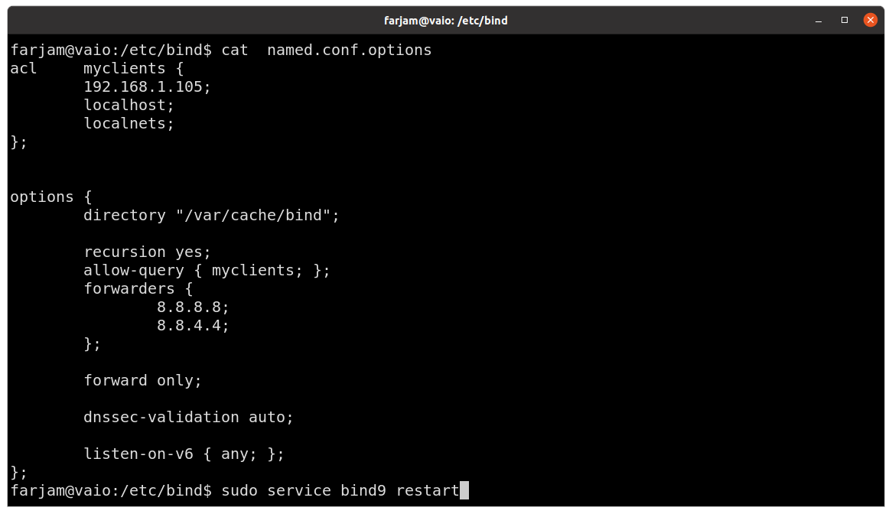
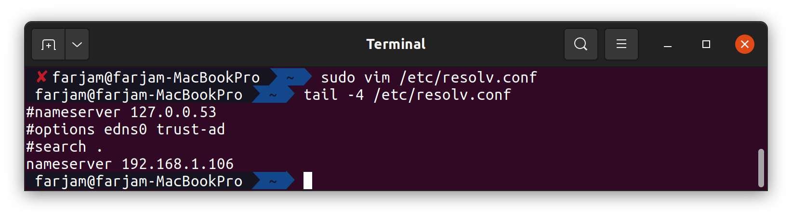
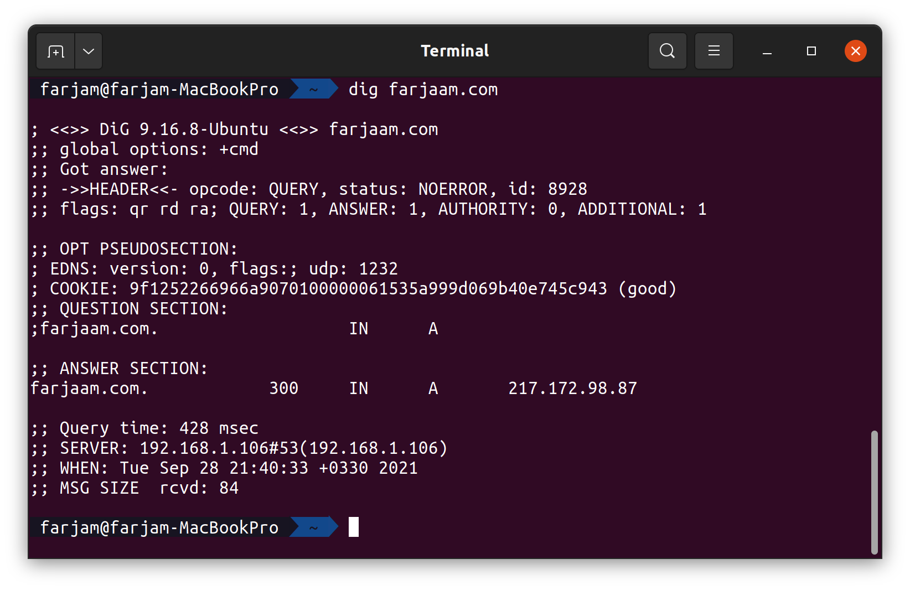
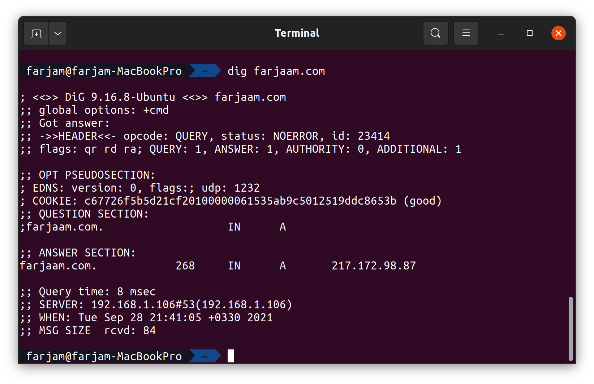
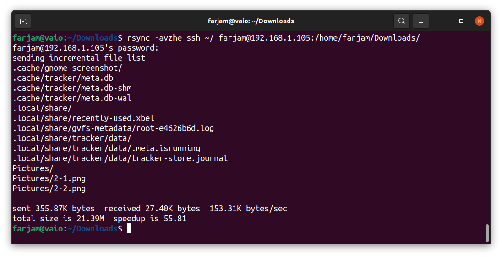
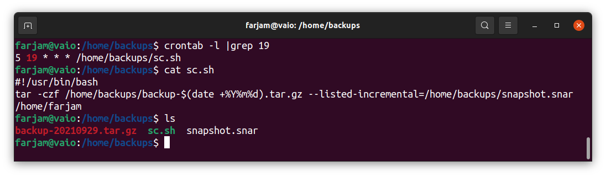
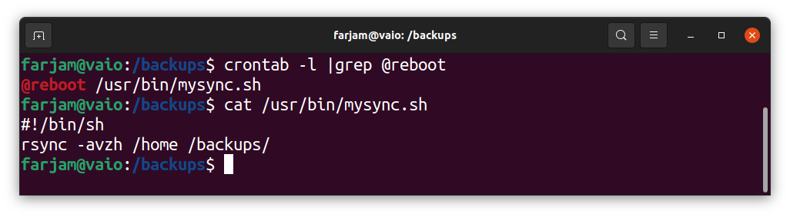

# LIPC2-08 ( Mr.Salahshoor Class Homework )

## Exercise 1
1. in DNS server edit /etc/bind/named.conf.options and add ip of clients.




2. in client pc go to /etc/resolv.conf and add ip of our server.




3. from client test server with dig. query time is 428 msec.

```bash
dig farjaam.com
```



4. one more time run dig command for last website. as we can see this time query time is less. its only 8 msec.




## Exercise 3
1. use rsync with ssh to copy home dir of local pc to a remote server.

```bash
rsync -avzhe ssh ~/ farjam@192.168.1.105:/home/farjam/Downloads/
```




## Exercise 4
1. edit crontab and add following line. 
```bash
crontab -e
5 19 * * * /home/backups/sc.sh
```
then make a script for tar command:

```bash
#!/usr/bin/bash
tar -czf /home/backups/backup-$(date +%Y%m%d).tar.gz --listed-incremental=/home/backups/snapshot.snar /home/farjam
```



## Exercise 5
1. add a crontab with @reboot then write a script as following:
```bash
#!/usr/bin/sh
rsync -avzh /home /backups/
```


