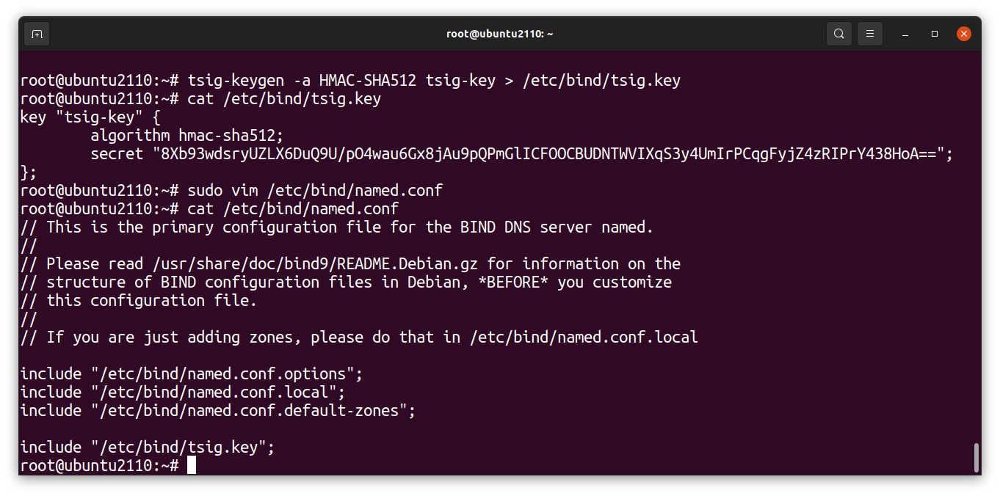
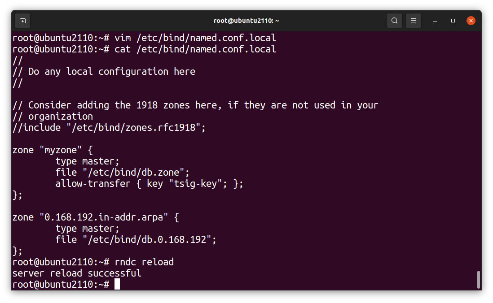
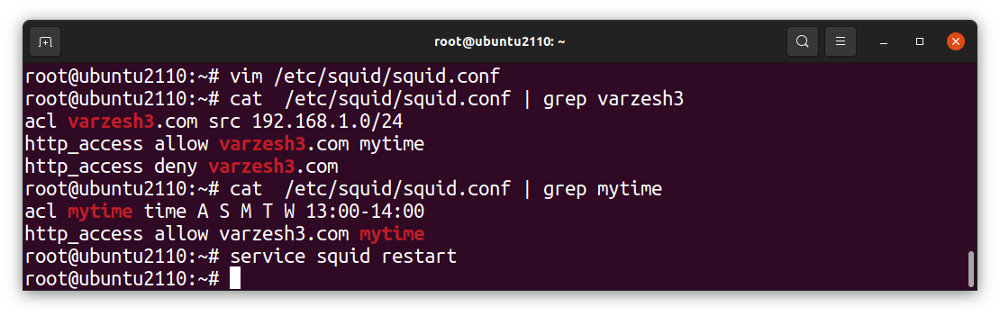
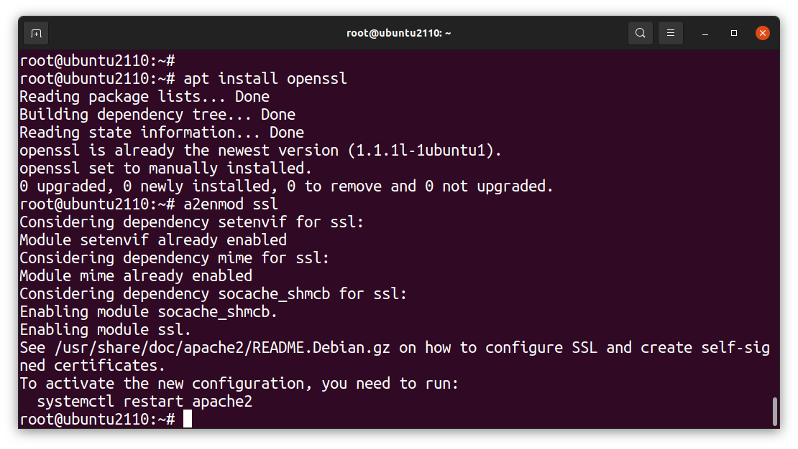
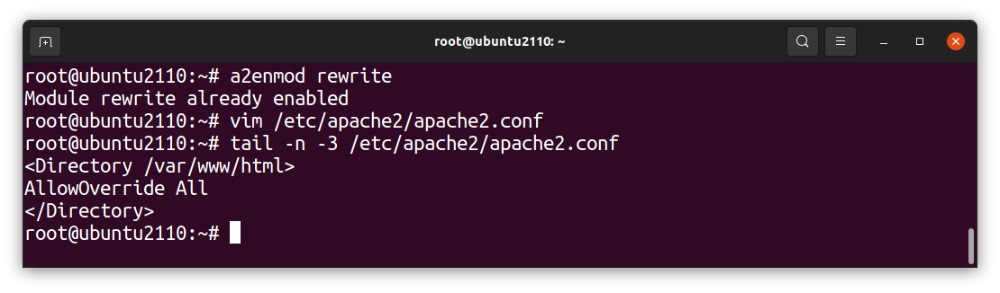
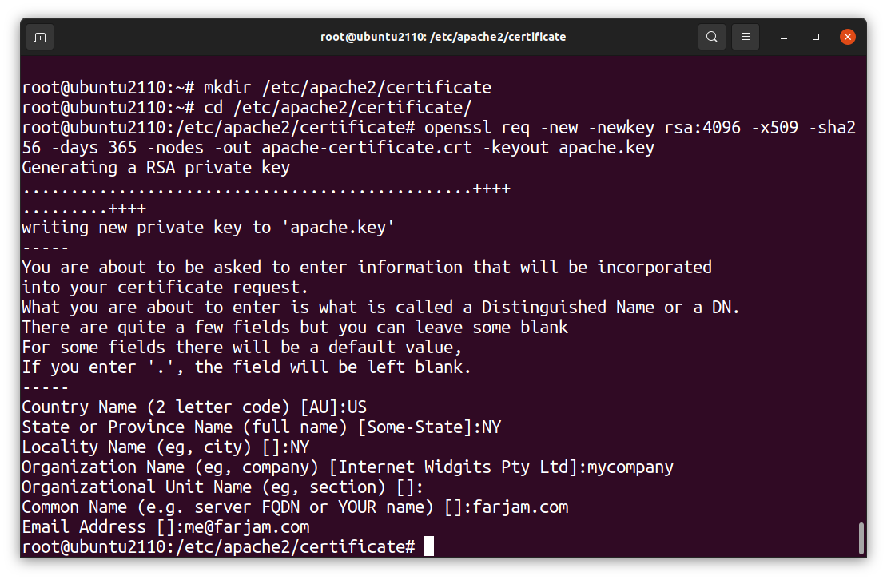
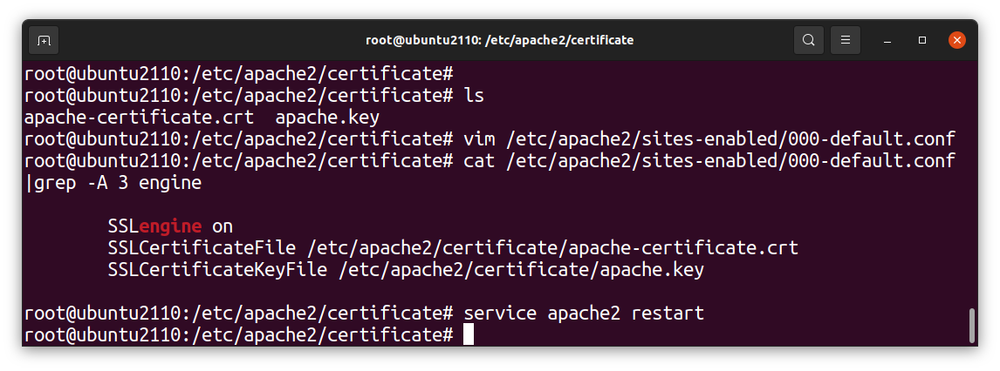

# LIPC2-08 ( Mr.Salahshoor Class Homework )

## Exercise 1
1. Use tsig in DNS server

## Exercise 2
1. Create rule in Squid proxy server for using varzesh3.com only between 13:00 and 14:00 

## Exercise 3
1. Use ssl (https) in apache

